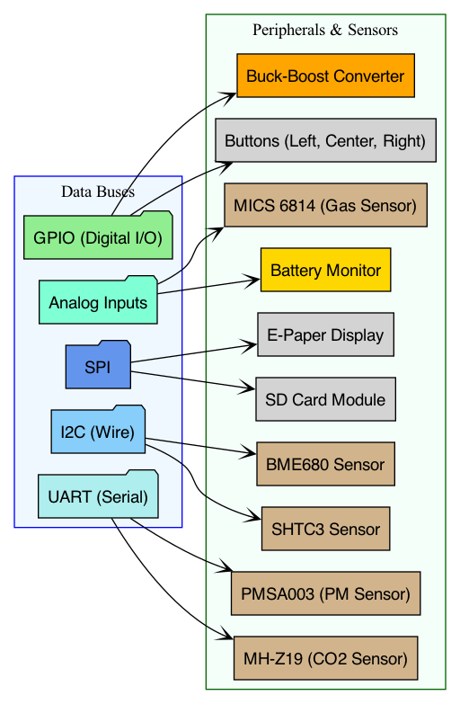
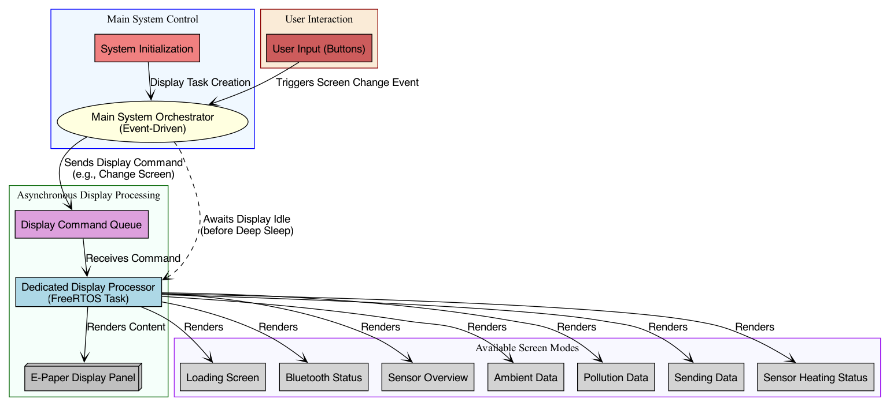
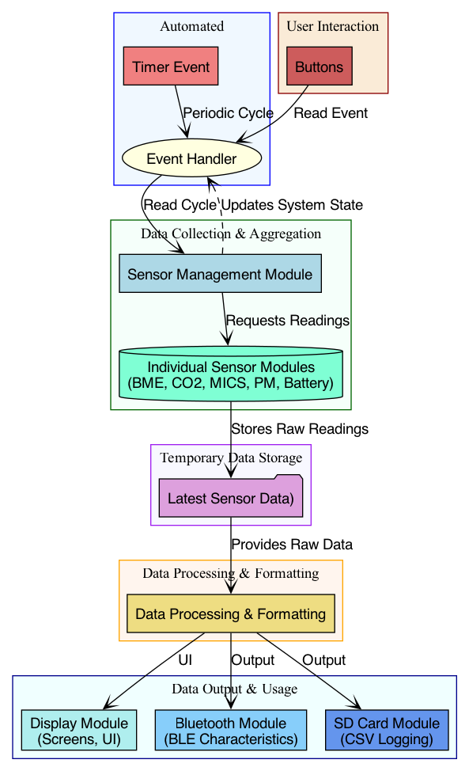
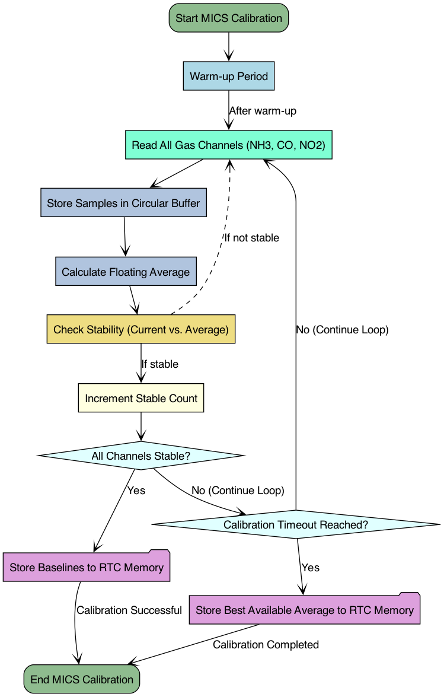

# CityAirQ

**CityAirQ** is an advanced firmware solution designed for next-generation mobile environmental trackers. Built on the robust **ESP32-S3** platform, this project empowers users to monitor hyper-local urban air quality in real-time. By integrating a comprehensive suite of sensors for Particulate Matter (PM), Volatile Organic Compounds (VOCs), and hazardous gases, CityAirQ transforms raw environmental data into actionable insights.

Designed for portability and endurance, the system features an ultra-low-power **E-Paper display** for sunlight-readable visualization and intelligent power management for extended battery life. Whether for personal exposure monitoring, citizen science, or smart city mapping, CityAirQ reliably logs complex environmental datasets to SD storage while offering seamless Bluetooth Low Energy (BLE) connectivity for mobile app integration.

## 🚀 Features

*   **Comprehensive Air Quality Monitoring**: Supports sensors for PM1.0, PM2.5, PM10, CO2, CO, NO2, NH3, VOCs, Temperature, Humidity, and Pressure.
*   **Low Power Display**: Utilizes an E-Paper display (epaper) for energy-efficient data visualization with multiple distinct screens (Sensors, Environmental, Pollutants, Bluetooth).
*   **Data Logging**: Logs historical sensor data to an SD card for long-term analysis.
*   **Bluetooth Connectivity**: BLE support for data transmission and device interaction.
*   **Power Management**: Deep sleep capabilities and battery monitoring to extend runtime on mobile power.
*   **Modular Design**: Sensor subsystems can be enabled/disabled via configuration flags.

## 🛠 Hardware Specifications

*   **MCU**: Espressif ESP32-S3 (DevKitC-1)
*   **Display**: E-Paper Display (Driver: GxEPD2)
*   **Real-Time Clock**: RV-3028-C7 (I2C)
*   **Storage**: MicroSD Card Module (SPI)
*   **Supported Sensors**:
    *   **BME680**: Temperature, Humidity, Pressure, Gas Resistance (VOCs).
    *   **MH-Z19**: CO2 concentration.
    *   **PMS5003/7003**: Particulate Matter (PM1.0, PM2.5, PM10).
    *   **MICS-6814**: CO, NO2, NH3.

### Hardware Buses & Pin Map
An explicit hardware buses and pins diagram is available as `docs/diagrams/cityairq_buses_pins.dot`. It documents which sensors use UART / I2C / SPI / Analog / GPIO and the main peripherals (display, SD, buttons, battery monitor).




## 💾 Project Structure

The project is built using [PlatformIO](https://platformio.org/).

```text
├── include/            # Header files for modules and resources
│   ├── Logger/         # Logging utilities
│   ├── Modules/        # Interface definitions for core modules
│   ├── Resources/      # Pin definitions and constants
│   ├── Sensors/        # Sensor class interfaces
│   └── Software/       # Data helpers
├── lib/                # External and custom libraries
│   ├── Adafruit_BME680_Library
│   ├── GxEPD2
│   ├── MH-Z19
│   ├── PMSerial
│   └── RTC_clock
├── src/                # Source code
│   ├── main.cpp        # Main entry point, setup, and loop
│   ├── configs.h       # Project configuration
│   ├── Modules/        # Core logic (Display, BLE, SD, etc.)
│   └── Sensors/        # Sensor implementations
└── platformio.ini      # Project configuration and build flags
```

## 🏗 Software Architecture

The CityAirQ firmware operates on an event-driven architecture designed to balance responsiveness with power efficiency. The system is orchestrated by a central coordination loop that reacts to state flags set by interrupts, timers, or user interactions.

### 1. Central Coordination (`main.cpp`)
The application core revolves around the `loop()` function, which monitors a global state structure (`board_config`). This structure acts as the central "mailbox" for the application. When an event occurs (e.g., a button press ISR, a timer interrupt, or a BLE callback), specific flags within `board_config` are set.
-   **Flag-Based Processing**: The loop continuously checks `board_config.to_treat`. If true, it evaluates subsystems (Sensors, Display, BLE, Power) to determine which component requires attention.
-   **Non-Blocking operations**: Routine tasks are dispatched to specific handlers (`treatSensors`, `treatDisplay`, etc.), ensuring the main loop remains responsive.

### 2. Asynchronous Display System
Driving E-Paper displays is time-consuming (often taking seconds). To prevent this from blocking critical sensor readings or user interactions, the display logic is decoupled:
-   **Display Task**: A dedicated FreeRTOS task (`DisplayTask.cpp`) handles the low-level SPI communication and E-Ink refresh sequences.
-   **Command Queue**: The main loop sends high-level commands (e.g., `CMD_SET_MODE`, `CMD_REFRESH`) to the Display Task via a thread-safe Queue (`displayQueue`). This allows the main system to "fire and forget" display updates.

#### Display Workflow Diagram
The asynchronous display flow (command queue, FreeRTOS task, rendering, and screen types) is documented in `docs/diagrams/cityairq_display_workflow.dot`.



### 3. Data Flow & Management
Environmental data flows through the system in a structured pipeline:
1.  **Acquisition**: Timer interrupts trigger sensor reading routines.
2.  **Aggregation**: Raw interactions with sensor drivers (mostly I2C/UART) are abstracted by wrapper classes in `src/Sensors/`.
3.  **Storage**: Collected data is aggregated into a central data structure (`lastSensorsData`), making it immediately available for the Display, Bluetooth, and SD Logging modules.

#### Sensor Pipeline Diagram
A step-by-step diagram of the sensor acquisition and processing pipeline (Timer → Sensor Manager → LatestSensorData → DataHandler → BLE/SD/Display) is available as `docs/diagrams/cityairq_sensor_pipeline.dot`.



### 4. Interactions & Communication
*   **User Input**: Button interrupts modify the `board_config.screen` state, triggering a display update command.
*   **Bluetooth Low Energy**: The BLE module operates proactively. When new sensor data is available, the system updates the corresponding BLE characteristics, notifying connected mobile clients.
*   **Power Management**: A finite state machine manages transitions between `AWAKE`, `LIGHT_SLEEP`, and `DEEP_SLEEP` based on activity timeouts and efficient battery usage policies.

### 5. Sensor Data Workflow 

The data acquisition pipeline is engineered for precision and reliability, following a strict "Wake-Measure-Sleep" cycle to conserve power.

**1. Triggering & Preparation:**
The process initiates via a `TIMER_READ` interrupt (configured in `Timers.cpp`). This sets the `SENSORS::PREPARE_SENSORS` state flag. The main loop detects this and calls `wakeUpSensors()`. Beause some sensors (like the PMS5003 and MICS-6814) require a pre-heat phase to ensure accuracy, the system waits for a defined warm-up period (`sensor_constants.h`).

**2. Acquisition:**
Once the sensors are stable (`SENSORS::HEATED_SENSORS` state):
*   **Reading**: The `Sensors.cpp` module iterates through all enabled drivers (BME680, MH-Z19, etc.).
*   **Abstraction**: Each sensor driver (e.g., `PM_sensor.cpp`) handles the low-level I2C/UART comms and validates the raw bytes (checksums, error flags).
*   **Aggregation**: Validated readings are normalized and stored in the global `lastSensorsData` structure defined in `board_constants.h`. This structure also captures the current timestamp from the RTC and battery voltage.

#### MICS Calibration Procedure
The MICS gas sensor calibration flow (warmup, buffering, averaging, stability checks, and saving baselines to RTC memory) is documented in `docs/diagrams/cityairq_mics_calibration.dot`.



Also see the high-level system diagram below.

**3. Data Routing (`DataHandler.cpp`):**
Immediate after acquisition, `handleLiveData()` is invoked to route the new dataset:
*   **Online Mode (BLE Connected)**: If a client is connected, data is pushed immediately to BLE Characteristics (Notifications).
*   **Offline Mode (Standalone)**: If no client is connected, `transferSDcard()` converts the struct into a standard CSV format string and appends it to the `DATA_PATH` file on the microSD card.

**4. Visualization:**
Concurrent with storage, the system triggers a `CMD_REFRESH` to the Display Task. The Display module (`Display.cpp`) reads from the shared `lastSensorsData` structure to update the E-Paper screen, ensuring the user always sees the latest snapshot without delaying the logging process.

## ⚙️ Configuration

The firmware behavior and hardware setup can be configured in `src/configs.h` (and `include/Resources/pins.h`).

Key compile-time switches (typically defined in `src/configs.h` or `main.cpp`):
*   `PM_ENABLE`: Enable Particulate Matter sensor.
*   `BME_ENABLE`: Enable BME680 environmental sensor.
*   `CO2_ENABLE`: Enable CO2 sensor.
*   `MICS_ENABLE`: Enable MICS gas sensor.

## 📦 Installation & Build

1.  **Prerequisites**:
    *   [VS Code](https://code.visualstudio.com/)
    *   [PlatformIO Extension](https://platformio.org/platformio-ide)

2.  **Clone the repository**:
    ```bash
    git clone <repository-url>
    cd CityAirQ
    ```

3.  **Build**:
    Open the project in VS Code (PlatformIO) and run the `Build` task. PlatformIO will automatically install the required library dependencies listed in `platformio.ini`.

4.  **Upload**:
    Connect your ESP32-S3 board via USB and run the `Upload` task.

## 🖥 Usage

Upon boot, the device initializes the activated sensors and the SD card.
*   **Navigation**: Use the board buttons to toggle between different screens:
    *   **Bluetooth**: Connection status and device info.
    *   **Sensors**: Overview of key readings.
    *   **Environmental**: Temp, Humidity, Pressure, Altitude.
    *   **Pollutants**: Detailed gas and PM data.
*   **Logging**: Data is automatically written to the SD card at defined intervals.

## 📄 License

[License Information Here - e.g., MIT, Proprietary, etc.]
